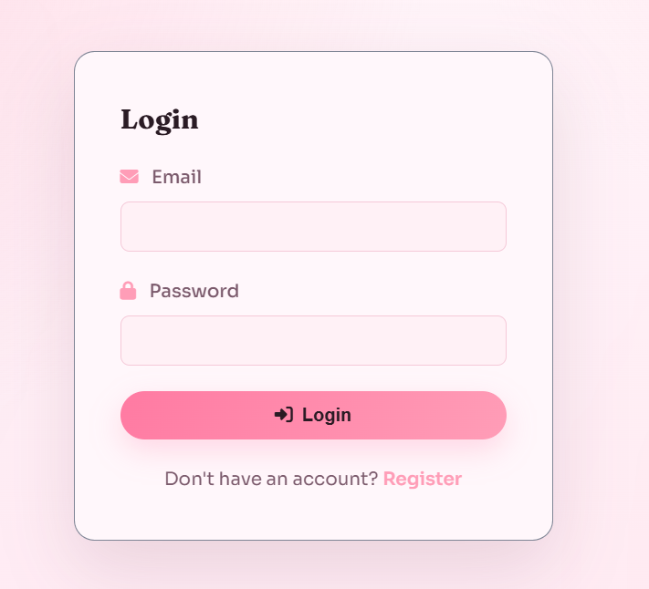
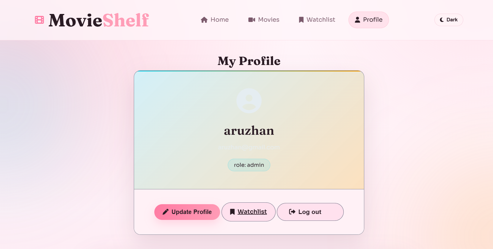
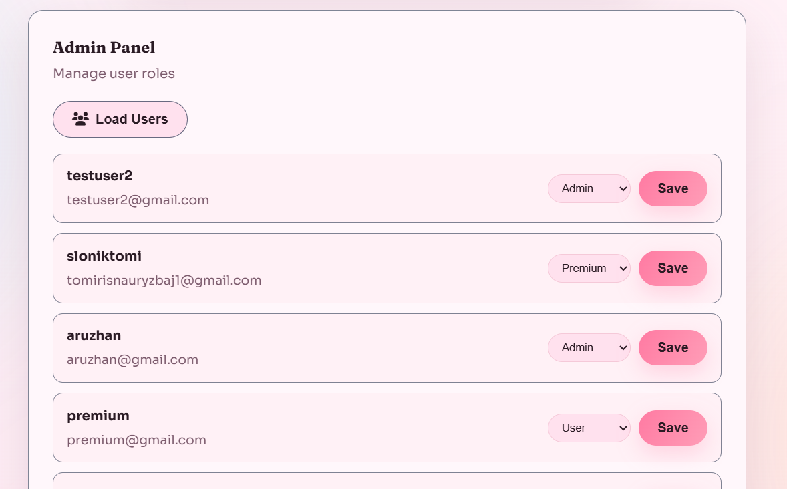
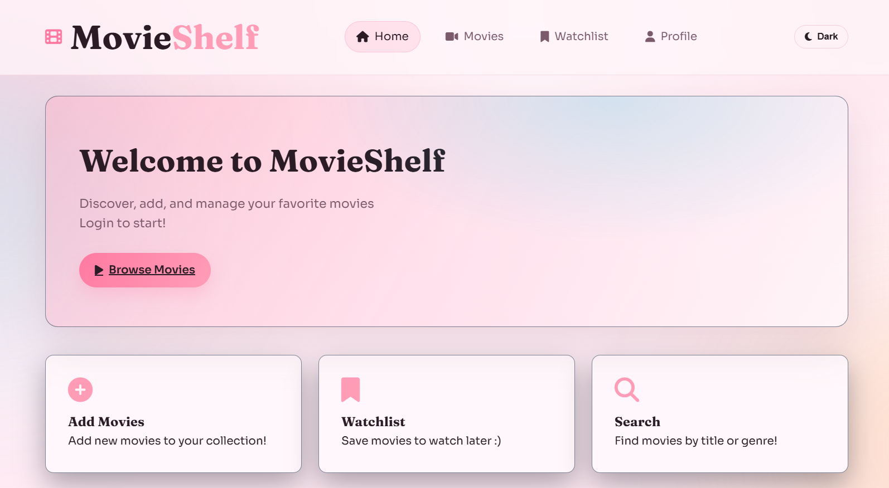
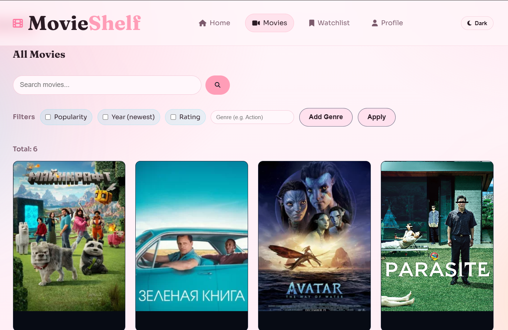
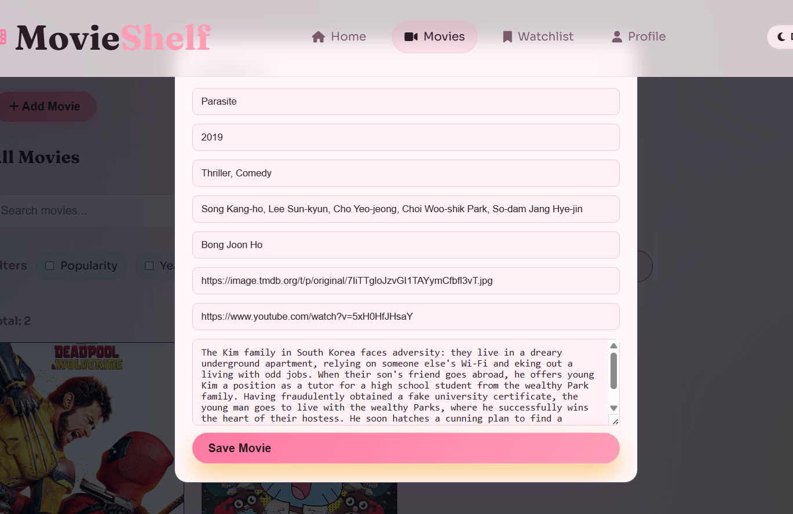
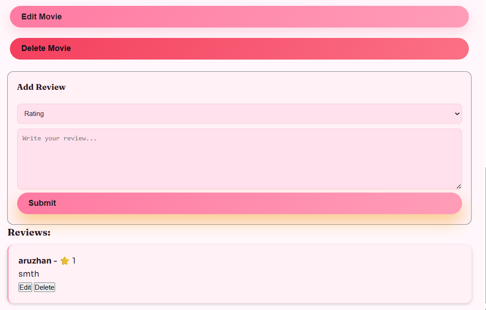
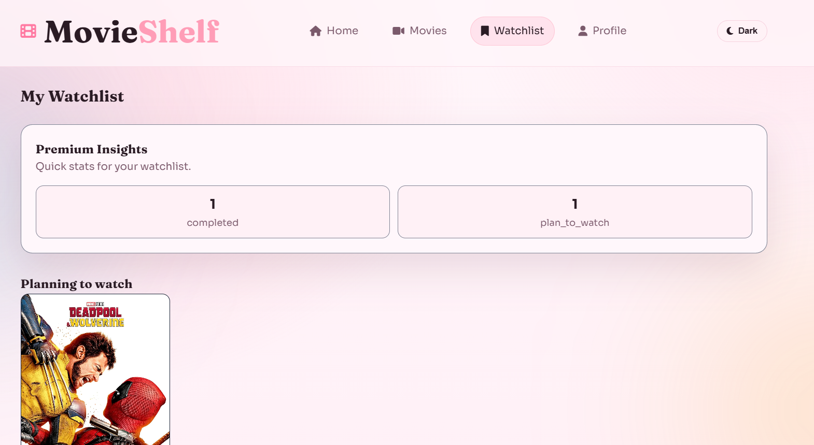

**Project overview**

**Movie Explorer - Movie Info, Ratings, Trailers & Reviews**

This project is a Movie Website API built using **Node.js, Express, and MongoDB** that allows users to explore movie information, ratings, trailers, and reviews. The system supports user accounts, personalized movie lists (plan to watch, completed, dropped, favorite), and community reviews. Also project has role-based control: users, premium users, admins.

• **Main features (List of key features of application)**

User:

\-User registration and logging in, profile management;

\-Movies with searching and filtering: movie details (title, poster, trailer link, description, year, cast, director, average rating, reviews);

\-Searching by title/name/genre;

\-Ability to add movies to personal watchlists, and managing those lists;

Admin:

\-Managing reviews, deleting users reviews if needed;

\-List of all users in website: ability to change their role;

\-Adding new movies;

\-View watchlist stats.

Premium:

\-View watchlist stats.

**Project setup**

Run:

cd .\\backend

npm install

Start server:

npm run dev

#### API Documentatition

#### Authentication

#### • POST /api/auth/register - register a new user

#### • POST /api/auth/login - user login with JWT authentication

#### User

#### • GET /api/users/profile - get user profile

#### • PUT /api/users/profile - update user profile

#### • GET /api/users/all- get all users

#### • PUT /api/users/:id/role - update user role(admin)

#### Movies and reviews

#### • GET /api/movies - get all movies (with pagination, filtering, and sorting)

#### • GET /api/movies/:id - get movie details

#### • GET /api/movies/:id/reviews - get movie reviews

#### • POST /api/movies - add a new movie (admin only)

#### • PUT /api/movies/:id - update movie information (admin only)

#### • DELETE /api/movies/:id - delete a movie (admin only)

#### • POST /api/movies/:id/reviews - add a review for a movie

#### • GET /api/movies/:id/reviews - get all reviews for a movie

#### • PUT /api/movies/:id/reviews/:reviewId - update a review

#### • DELETE /api/movies/:id/reviews/:reviewId - delete a review (user, admin)

#### User Movie Lists

#### • POST /api/watchlist- add a movie to watchlist

#### • GET /api/watchlist - get watchlists

#### • GET /api/watchlist/stats - get watchlists stats(premium/admin)

#### • PUT /api/watchlist/:id - update watchlist

#### • DELETE /api/watchlist/:id - delete from watchlist

#### Screenshots
## Registration Page

## Login Page

## Profile Page

## Admin panel 

## Home Page

## Movies Page

## Add movie modal

## Reviews

## Add to watchlist

## Watchlist page

## Remove from watchlist
